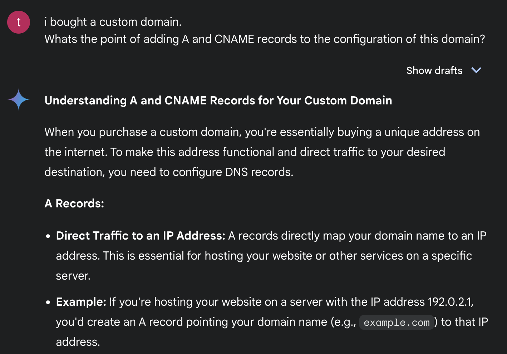
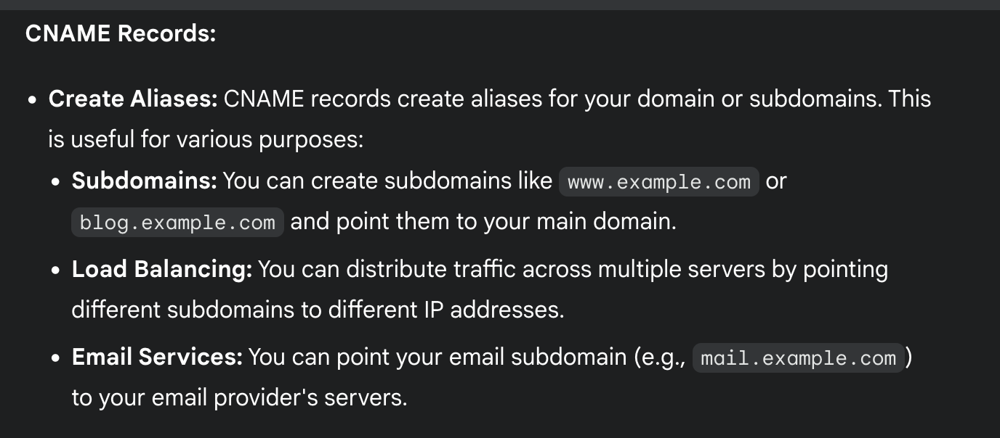
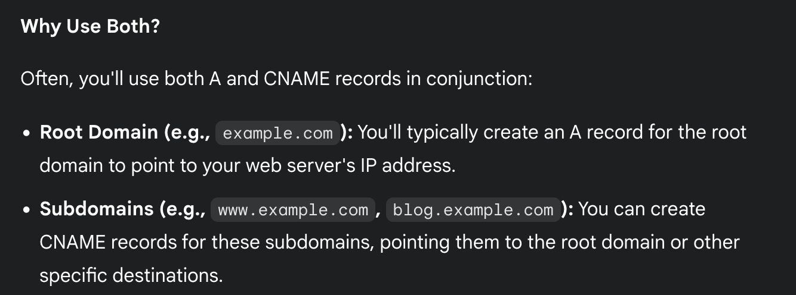

# docs about deep link in android:

https://codewithandrea.com/articles/flutter-deep-links/

# docs about using custom domains in github-pages

https://docs.github.com/en/pages/configuring-a-custom-domain-for-your-github-pages-site/managing-a-custom-domain-for-your-github-pages-site
https://www.geeksforgeeks.org/publish-websites-on-github-pages-with-a-custom-domain/

# link to this page/domain:

https://tatitati.github.io/rentadvisor_domain/

domain used:
test-rentadvisor.com


confirm dns in domain.com is working:
dig test-rentadvisor.com +noall +answer -t A


## deep link stuff:

Deep linking needs a sha256_cert_fingerprints
This cert fingerprint is usually obtained in play store once you have the app ready to release. However, until then, i need one to test.
To have one during the development I can produce locally one doing:


1. Create a keystore. This is a file that stores cryptographic keys, including the one I'll use to sign my app.
```
$ keytool -genkeypair -v -keystore key-rentadvisor.jks -keyalg RSA -keysize 2048 -validity 10000 -alias key-rentadisor


Enter keystore password: XXXXX
Re-enter new password:   XXXXX
What is your first and last name?
  [Unknown]:
What is the name of your organizational unit?
  [Unknown]:
What is the name of your organization?
  [Unknown]:
What is the name of your City or Locality?
  [Unknown]:
What is the name of your State or Province?
  [Unknown]:
What is the two-letter country code for this unit?
  [Unknown]:
Is CN=Unknown, OU=Unknown, O=Unknown, L=Unknown, ST=Unknown, C=Unknown correct?
  [no]:  yes

Generating 2,048 bit RSA key pair and self-signed certificate (SHA256withRSA) with a validity of 10,000 days
	for: CN=Unknown, OU=Unknown, O=Unknown, L=Unknown, ST=Unknown, C=Unknown
[Storing key-rentadvisor.jks]
```

2. Extract the fingerprint doing:

```
keytool -list -v -keystore key-rentadvisor.jks -alias key-rentadisor
```

3. Buy a cheap domain, and update the DNS records ot point to your github-pages:






4.Test the domain. You have to Install android emulator first:

```
brew install android-platform-tools
```

Then test


```
adb shell am start -a android.intent.action.VIEW \
      -c android.intent.category.BROWSABLE \
      -d https://yourDomain.com \
      <package name>
```

which results in 

```
adb shell am start -a android.intent.action.VIEW \
    -c android.intent.category.BROWSABLE \
    -d https://tatitati.github.io/rentadvisor_domain/ \
    com.rentadvisor
```


# after configuring the dns in domain.com

```
$ dig www.test-rentadvisor.com +noall +answer -t A


; <<>> DiG 9.10.6 <<>> www.test-rentadvisor.com +noall +answer -t A
;; global options: +cmd
www.test-rentadvisor.com. 3600	IN	A	185.199.108.153
www.test-rentadvisor.com. 3600	IN	A	185.199.111.153
www.test-rentadvisor.com. 3600	IN	A	185.199.110.153
www.test-rentadvisor.com. 3600	IN	A	185.199.109.153
```
